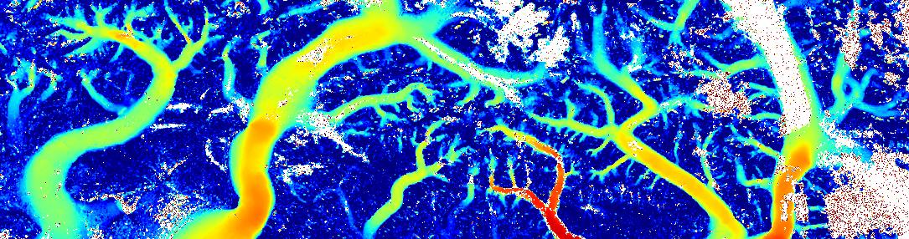
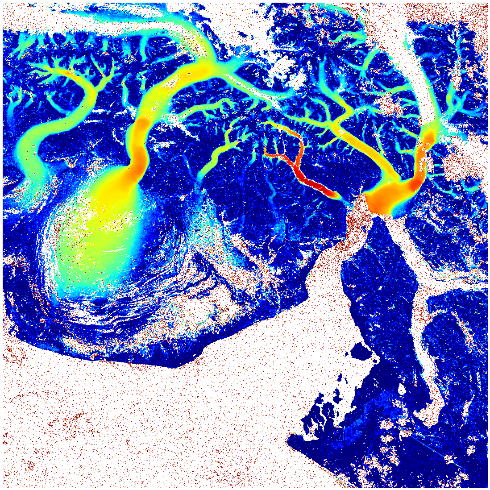
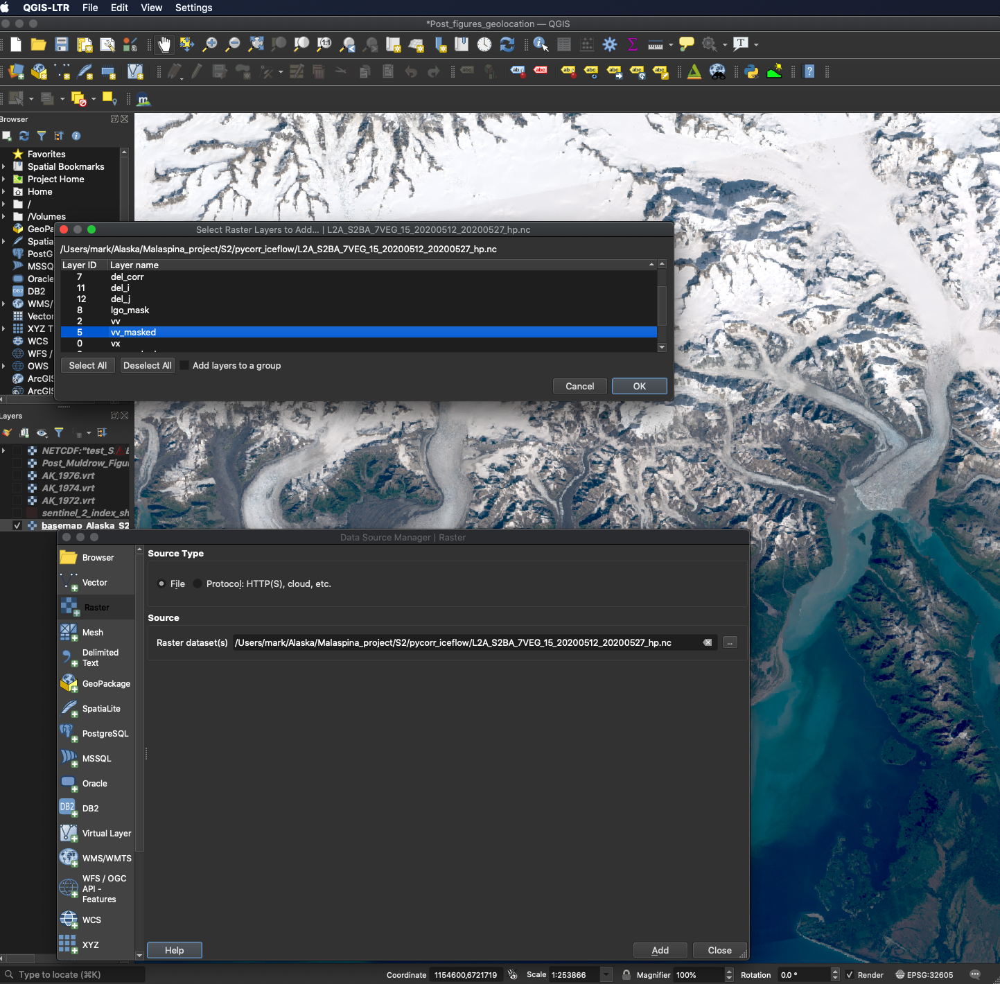
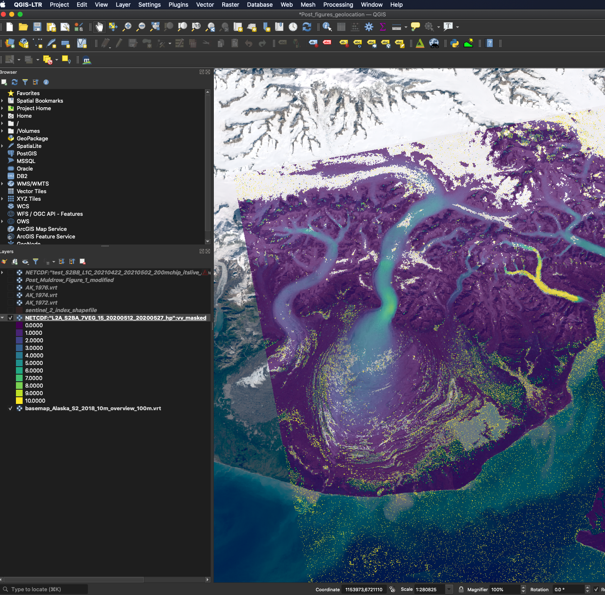

# pycorr_iceflow

# Ice flow "feature" offset tracking in satellite images

## basic fuction
`pycorr_iceflow_1.1.py` is based on the approach described in [Rapid large-area mapping of ice flow using Landsat 8](https://www.sciencedirect.com/science/article/pii/S003442571530211X) and the production code used for the [GoLIVE Landsat 8 processing](https://nsidc.org/data/golive) at NSIDC. It determines offsets at a user-specified grid spacing by comparing a square patch of pixels (a "chip") from an earlier image to the pixels in a larger square patch in a later image using the openCV cv2.matchTemplate function, a dft-based cross correlation which returns a correlation surface at integer pixel offsets between the two image chips.  Sub-pixel offset is determined by finding the peak of the spline of the correlation surface in the vicinity of the highest integer correlation peak.

---
## why pycorr?
pycorr is a "relatively" light weight python script that exploits [GDAL](https://gdal.org) and [openCV](https://opencv.org) to rapidly determine offsets in an image pair. Because it uses GDAL for image I/O, it can use image pairs in many geospatial formats, with the caveat that the images do overlap some spatially and that their image pixels have the same size. pycorr produces a netCDF4 file with offsets and correlation values at a user-specified grid resolution in the same projection as the original images **if** the input images are in a UTM or Antarctic Polar Stereo (epsg:3031) projection - this is the set of projections used for Landsat imagery.  If your images are in a a different projection, you are not out of luck - use the `-output_geotiffs_instead_of_netCDF` option to output in the same projection as the input images - this option allows any projection GDAL knows about, which is most.  The issue here is that the netCDF4 cf geolocation spec requires a variable block in the output file that is named after the projection, making it difficult to support all projections in a simple way.

There are a number of packages that provide similar analyses and may have more sophisticated approaches to identifying and filtering "noisy" matches, which can be due to cloud cover, surface change, low contrast features or an absence of features, shadows, and low signal-to-noise input imagery.  pycorr is intentionally simple - it does not use a series of larger chip sizes if the initial match fails to find a peak at a location; it returns a limited set of metrics that help document the uniqueness and strength of a peak that can be used to filter the output, but it does not attempt to provide an error estimate for each match.

pycorr is computationally fast because of the use of numpy and the openCV library, and so can process an image pair in minutes or tens of minutes depending on the image sizes and requested grid spacing and maximum offset specified for the search.  This process can be sped up by using land and ocean masks to limit search distances off of the ice and also by using reference ice flow speed maps to set search distances larger in fast flowing areas and smaller in slow flowing areas, but for simplest uses these are not applied.

---
## installation
The libraries required to run pycorr can be installed into a local environment with [Anaconda](https://www.anaconda.com/products/individual) pulling from the [conda-forge](https://conda-forge.org) repository:
### create environment
```
 conda create --name test_pycorr_env -c conda-forge numpy matplotlib gdal=3.1.2 netCDF4 psutil scipy opencv ipython fiona shapely pyproj boto3 git
```

At the time of writing (5/5/2021) the current gdal in conda-forge (3.2.2) did not install python bindings properly - version 3.1.2 was specified here to avoid this issue.

### clone the repository
```
git clone https://github.com/markf6/pycorr_iceflow.git
```

[From this repository the only file you need at this point is pycorr_iceflow_1.1.py]

---
## example run
### activate the conda environment:
```
conda activate test_pycorr_env
```


#### get two Sentinel 2 images from the [AWS S2 Level2A CloudOptimizedGeotiff (COG) public data archive](https://registry.opendata.aws/sentinel-2-l2a-cogs/)

```
curl https://sentinel-cogs.s3.us-west-2.amazonaws.com/sentinel-s2-l2a-cogs/7/V/EG/2020/5/S2B_7VEG_20200512_0_L2A/B08.tif --output S2B_7VEG_20200512_0_L2A_B08.tif
curl https://sentinel-cogs.s3.us-west-2.amazonaws.com/sentinel-s2-l2a-cogs/7/V/EG/2020/5/S2A_7VEG_20200527_0_L2A/B08.tif --output S2A_7VEG_20200527_0_L2A_B08.tif
```

### run pycorr on this image pair, generate output netCDF4 (.nc) data file and browse GeoTIFF (with log colorscale)
```
python pycorr_iceflow_v1.1.py -imgdir . S2B_7VEG_20200512_0_L2A_B08.tif S2A_7VEG_20200527_0_L2A_B08.tif \
                              -img1datestr 20200512 -img2datestr 20200527 -datestrfmt "%Y%m%d" \
                              -inc 10 -half_source_chip 10  -half_target_chip 55 -plotvmax 25 -log10 \
                              -out_name_base L2A_S2BA_7VEG_15_20200512_20200527 -progupdates -use_itslive_land_mask_from_web
 ```
### explanation of these options
```
-imgdir . [image files are in current directory]
or
-img1dir aaa -img2dir bbb [specify directories for each image file]

img1.tif img2.tif  [the band 8 input file names - S2B_7VEG_20200512_0_L2A_B08.tif S2A_7VEG_20200527_0_L2A_B08.tif 
                    in this case - can be any geospatial format GDAL can read (.jp2 for S2 L1C images works, etc)]

-img1datestr 20200512 -img2datestr 20200527 -datestrfmt "%Y%m%d"   [specify the image acquisiton dates using the specified format %Y is 
                                                                    4 digit year, %m is two digit month (01 - 12), %d is two digit day 
                                                                    (01-31). If not specified, pycorr will look for the date in the 
                                                                    Landsat or S2 filename, but the conventions for these vary and may 
                                                                    not be covered]

-inc 10 -half_source_chip 10  -half_target_chip 55 
[-inc is output grid spacing in input image pixels (for S2 10m pixels, output will have 100m pixel size)]
[-half_source_chip 10 specifies that a 20 x 20 pixel "chip" will be taken from each the grid pixel center]
[-half_target_chip 55   specifies a 110 x 110 pixel "chip" in the second image - search looks at every integer pixel offset 
                        of the source chip within the target chip, generating a correlation surface, and then reports the peak 
                        in the splined correlation surface at subpixel level (to 1/100th of a pixel)]

                        Note that maximum trackable offset in x or y is (half_target_chip - half_source_chip) * 
                        input_pixel_size_in_meters - so for this example (55 pixels - 10 pixels) * 10 m/pixel = 
                        max trackable offset of 450 meters, or 30 m/d for this 15-day pair.

-plotvmax 25 -log10    [these two together cause a color scale GeoTIFF browse image to be generated - log color scale, 
                        max velocity for browse image color scale is 25 m/d (only for browse image - DOES NOT EFFECT 
                        max trackable offset set by half_source_chip and half_target_chip above)

-out_name_base L2A_S2BA_7VEG_15_20200512_20200527 [a string you specify for the start of the output filename, so you remember what you did]

-progupdates [output updates for each 10% of the input image rows processed, so you aren't staring at a blank screen]

-use_itslive_land_mask_from_web [pycorr will search the its-live-data.jpl.nasa.gov.s3.amazonaws.com S3 bucket - first it pulls an index 
                                 shapefile and uses the center lat,lon of the overlap of the input images to figure out which its-live 
                                 land mask to use, then it builds a local land mask based on it and uses it for offset correction between 
                                 the two images - this makes the "land" chips have a 0 median offset, which provides an initial correction 
                                 for geolocation offset between the pair of images - very important for short time intervals]

```


### output files

the output browse image (speed represented by log colorscale, with dark red = 25 m/d (-log10 -plotvmax 25))


The output netCDF4 file (L2A_S2BA_7VEG_15_20200512_20200527.nc) can be opened as a raster in QGIS - 
    choose the "vv_masked" layer to get ice flow speed, or vx_masked and vy_masked to get the vector components of the flow speed 
    in projection x and y meters/day.

selecting vv_masked layer from netCDF4 .nc file




The selected layer, with colorscale applied



---
## major sources of error
As a working point of reference the offsets determined in images of good quality over surfaces with recognizable features can be determined to 0.1 pixels or better. It is difficult to quantify this accuracy for any single match however. A sense of the background accuracy of the matching process for an image pair can be gained by looking at the scatter in the offsets determined for land pixels. Note that this scatter is likely similar for images separated in time by a few days or for a year - meaning that the same scatter would produce a much larger scatter in velocity determined from a few-day pair than from a pair with longer time separation. It is always a tradeoff to use longer pairs for accuracy if the ice you are studying has rapid variations in velocity over time - every image pair velocity field is a time-averaged displacement measurement.

A typical Landsat or Sentinel 2 satellite image has a geolocation accuracy that may be tens of meters - this can translate into an offset between two images of a few pixels.  This simple offset is the largest source of error in a velocity determination if the time interval between two images is short - a 15m (one pixel) offset for a 16-day Landsat 8 pair would result in a background "speed" over land of nearly 1 meter/day.  The same offset for an image pair that had a 365-day time separation would produce a background "speed" over land of a few cm/day.  For most slow flowing ice, if there is a significant amount of land visible in the imagery, one will want to use a land mask that can identify the non-ice pixels, so that the background offset can be removed at the time of processing.  This version of pycorr is able to use the global land masks that are presently online as part of the [ITS_LIVE project](https://its-live.jpl.nasa.gov), but this will require an internet connection at the time the code is run.  It is also possible to have your own local mask file - either a land(1)/glacier(0)/water(0) mask or a water(2)/land(1)/glacier(0) mask will work - it will be reprojected and sampled at the output grid resolution during processing. The second of these will also allow limiting search distances over water, speeding up processing.


A second common source of error is internal distortion in the satellite imagery because of limited accuracy in the surface elevation model used by the image provider to geolocate the pixels in the image. While many optical imagers take images from a near-nadir viewpoint, the width of the image swath is large enough that pixels near the edge of the swath are viewed from an angle off nadir - meaning that any error in an elevation model used to map those pixels to the surface of the Earth will mis-locate them relative to pixels in the image center.  If the ground location in question is to the right of the satellite on one pass, and to the left on an adjacent pass, then the topographic error will produce offsets in opposite directions. This parallax is the signal that is used to map topography from stereo imagery, but for ice flow mapping it isn't a good thing. It is also the case that topographic errors are much more common over rapidly flowing or rapidly melting ice than over any other land cover type.  There is a simple solution to this problem: **use images from the same orbit track** so that the topographic distortion is essentially the same in both images - this eliminates 95% of the issue.  For Landsat this means using image pairs with the same path and row designations. For Sentinel 2 there is a similar "track" in the metadata, but the easiest approach is to use images separated by multiples of 5 days - so a 5 day S2A x S2B pair, or a 10 day S2A x S2A or S2B x S2B pair (Sentinel 2 A and B are in 10-day repeat orbits, staggered 5 days apart).


## the full set of options
```
usage: pycorr_iceflow_v1.1.py [-h] [-imgdir IMGDIR] [-img1dir IMG1DIR] [-img2dir IMG2DIR] [-output_dir OUTPUT_DIR] [-img1datestr IMG1DATESTR]
                              [-img2datestr IMG2DATESTR] [-datestrfmt DATESTRFMT] [-out_name_base OUT_NAME_BASE] [-bbox min_x min_y max_x max_y]
                              [-plotvmax PLOTVMAX] [-trackvmax TRACKVMAX] [-nodatavmax NODATAVMAX] [-half_source_chip HALF_SOURCE_CHIP]
                              [-half_target_chip HALF_TARGET_CHIP] [-inc INC] [-gfilt_sigma GFILT_SIGMA] [-dcam DCAM] [-cam CAM] [-cam1 CAM1]
                              [-lgo_mask_filename LGO_MASK_FILENAME] [-lgo_mask_file_dir LGO_MASK_FILE_DIR] [-use_itslive_land_mask_from_web]
                              [-VRT_dir VRT_DIR] [-max_allowable_pixel_offset_correction MAX_ALLOWABLE_PIXEL_OFFSET_CORRECTION]
                              [-do_not_highpass_input_images] [-v] [-mpy] [-log10] [-nlf] [-progupdates] [-output_geotiffs_instead_of_netCDF]
                              [-offset_correction_lgo_mask] [-lgo_mask_limit_land_offset]
                              img1_name img2_name

uses image to image correlation to detect offsets in surface features; 
    				produces map of offsets in units of pixels and velocity in m/day or m/year

positional arguments:
  img1_name             image 1 filename
  img2_name             image 2 filename

optional arguments:
  -h, --help            show this help message and exit
  -imgdir IMGDIR        single source dir for both images [.]
  -img1dir IMG1DIR      source dir for image 1 [.]
  -img2dir IMG2DIR      source dir for image 2 [.]
  -output_dir OUTPUT_DIR
                        output dir [.]
  -img1datestr IMG1DATESTR
                        date string for image 1 [None - set from L8 filename]
  -img2datestr IMG2DATESTR
                        date string for image 2 [None - set from L8 filename]
  -datestrfmt DATESTRFMT
                        date string format for img1datestr and img2datestr [None - set from L8 filename] eg. %m/%d/%Y - SEE:
                        https://docs.python.org/2/library/datetime.html#strftime-and-strptime-behavior
  -out_name_base OUT_NAME_BASE
                        output filename base
  -bbox min_x min_y max_x max_y
                        bbox for feature tracking area in projection m - minx miny maxx maxy - defaults to entire common area between images
  -plotvmax PLOTVMAX    max vel for colormap [15]
  -trackvmax TRACKVMAX  max vel that can be tracked (half_target_chip will be made larger if necessary, but if speed_ref is slow, that limit will be
                        used...) [not set]
  -nodatavmax NODATAVMAX
                        max vel (m/d) that can be tracked if speedref file is used and has nodata at location (using trackvmax for this for large time
                        separations impractical - think ocean pixels...) [0.333000]
  -half_source_chip HALF_SOURCE_CHIP
                        half size of source (small) chip [10]
  -half_target_chip HALF_TARGET_CHIP
                        half size of target (large or search) chip [20]
  -inc INC              inc(rement) or chip center grid spacing in pixels (must be even integer) [20]
  -gfilt_sigma GFILT_SIGMA
                        gaussian filter sigma (standard deviation in pixels for Gaussian kernel) [3.000000]
  -dcam DCAM            min difference between corr peaks 1 and 2 for mask ( full mask statement: masked_where(((del_corr_arr<dcam)&(corr_arr<cam)) |
                        (corr_arr<cam1)) ) [0.050000]
  -cam CAM              corr peak max value for dcam & cam mask (see full mask statement in -dcam help) [1.000000]
  -cam1 CAM1            corr peak value max for or mask (see full mask statement in -dcam help) [0.000000]
  -lgo_mask_filename LGO_MASK_FILENAME
                        file name for land_glacier_ocean mask file (used for lgo-mask-based offset correction) [None]
  -lgo_mask_file_dir LGO_MASK_FILE_DIR
                        path to diretory containing land_glacier_ocean mask file (used for lgo-mask-based offset correction) [None]
  -use_itslive_land_mask_from_web
                        pull a land mask from itslive.jpl.nasa.gov S3 bucket (will enable offset correction and disable local lgo_mask use) [False if
                        not raised]
  -VRT_dir VRT_DIR      path to directory where temporary .vrt files will be stored, then deleted, for access to part of speed_ref or lgo-mask mosaic
                        [.]
  -max_allowable_pixel_offset_correction MAX_ALLOWABLE_PIXEL_OFFSET_CORRECTION
                        if calculated offset correction of any type is larger than this many pixels, it will NOT be applied [3.000000 pixels]
  -do_not_highpass_input_images
                        DO NOT highpass input images before correlation - [highpass images before correlation]
  -v                    verbose - extra diagnostic and image info put in log file [False if not raised]
  -mpy                  meters per year - [meters per day if not raised]
  -log10                output second rgba color image that is log10(v) (and second kmz with colorbar in addition to GTiff if requested) - [only linear
                        color image produced]
  -nlf                  do not output log entries in nc file that contain command line etc - [output log entries in nc file]
  -progupdates          do not provide progress updates - [output progress updates]
  -output_geotiffs_instead_of_netCDF
                        output GeoTIFFs of vx,vy,vv,del_corr instead of .nc file with layers (supports all GDAL projections, netCDF only supports
                        UTM,PS) - [no]
  -offset_correction_lgo_mask
                        estimate offset from land pixels and make correct output vels with constant vx and vy shifts (requires -lgo_mask_file - [False]
  -lgo_mask_limit_land_offset
                        when source chip center is a land pixel, limit search distance (requires -lgo_mask_file - [False]

```
                        


